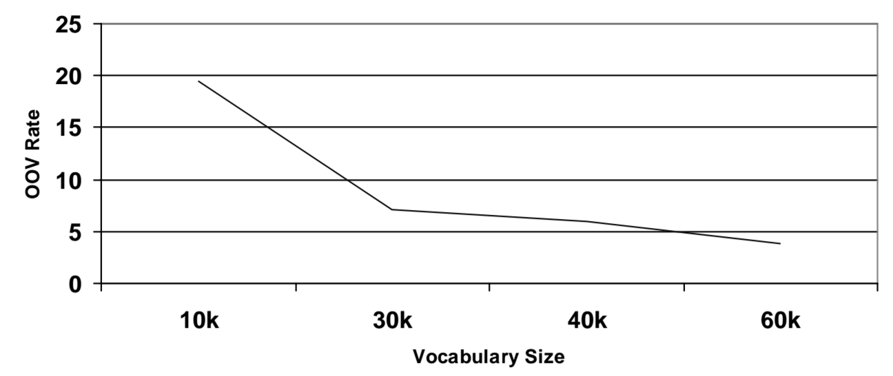
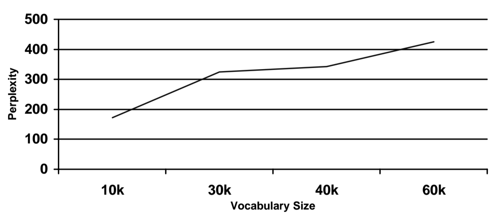

<div class="abstract">

This exercise is a guide with destination the model of a language with
the [SRILM - The SRI Language Modeling
Toolkit](http://www.speech.sri.com/projects/srilm/). The training corpus
used will be some journal-style writings from a translation shared task,
[Machine Translation of
News](http://www.statmt.org/wmt17/translation-task.html), and the test
corpus will be taken from the [assignment
proposal](https://github.com/jarfo/st2). Also, some code in order to
prepare the data will be token from it. The process of this exercise
will be to use the N-gram language model kind, to check it with
different $n$ values (monogram, bigram, trigram, …), two different
corpora and a mix of them. Finally, the best language model will be
selected.

</div>


Introduction
============

The problem of building a language model could be approached by defining
the set of rules that the language follows (the grammar), but this is a
very complex and computationally inefficient solution and it needs
directly the work of a human. Instead, using Machine Learning, the
probabilistic relationship between words or sequence of words can be
directly derived and modeled from an already created text or set of
texts (a **corpus**). The models that behave like described before are
known as the **Stochastic Language Models** and the avoid the need to
create broad grammars, therefore, they are often used.

N-gram model
------------

The N-gram model is a kind of Stochastic Language Model that are also
termed Markov models, because of its behaviour. The N-gram model take
into account the probability of a single word or a string of them (of
length $n$) in order to calculate the probability of a word to appear or
to after some string of length $n$. When $n = 1$ the probability of a
single word is calculated (monogram), when $n = 2$ it calculated the
probability of appearing a word after another (bigram), …

The N-gram model follows the concept of the Naive Bayes Estimator, that
consider each event independent from the rest. Although it seems an
idiotic and unrealistic assumption, it works quite well in practice.
Therefore, the probability distribution that defines a language model
will be:

$$P(\pmb{W}) = P(\w_1, \w_2, ..., \w_n) = \prod_{i=1}^n P(\w_i | \w_1, \w_2, ... ,\w_{i-1})$$

The conditional probabilities are calculated as the **Maximum
Likelihood**

$$P(\w_i | \w_{i-(n-1)}, \w_{i-(n-2)}, ... , \w_{i-1}} =$$
$$= \frac{C(\w_{i-(n-1)}, \w_{i-(n-2)}, ... , \w_{i-1}, \w_i)}{C(\w_{i-(n-1)}, \w_{i-(n-2)}, ... , \w_{i-1})}$$

where $C(\cdot)$ represents the number of times that the words appear
all together.

### Smoothing

The previous model is unlikely to generalize well to new sentences as
soon as if some word does not appear in the corpus, the model gives 0
probability for it. For the same reason, with n-gram models the amount
of training data is of million of words. Thus, smoothing is critical to
make estimated probabilities robust for unseen data. Smoothing
techniques adjust the maximum likelihood for unseen data, although the
likelihood for the training data may be hurt slightly. They tend to make
distributions more uniform adjusting low probabilities upward and high
probabilities downward.

There are two different Smooth N-Gram models:

-   Backoff models
-   Interpolated models

The difference between them lies in that the backoff models do the
distinction between the 0 probability words and the rest, besides the
interpolated do not. As soon as the SRILM software only has backoff
model, just this model will be considered @srilmpaper. All the backoff
algorithms follow the next equation

$$\small \begin{aligned}&P_{smooth}(\w_{i}\mid \w_{i-(n-1)}\cdots \w_{i-1}) = \\[1pt]={}&{\begin{cases}\alpha(\w_i | \w_{i-(n-1)} ... \w_{i-1})&{\text{if }}C(\w_{i-(n-1)}\cdots \w_{i})>0\\[1pt]\gamma (\w_{i-(n-1)}\cdots \w_{i-1}) \cdot \\ \cdot P_{smooth}(\w_{i}\mid \w_{i-(n-2)}\cdots \w_{i-1})&{\text{if }}C(\w_{i-(n-1)}\cdots \w_{i}) = 0}}\end{cases}}\end{aligned}$$

Quality Measure
---------------

In order to know how good a language model could be, without fully
testing it, two measures are used **Out-Of-Vocabulary (OOV)** range and
**Perplexity**. The OOV range is the number of words that are not in the
vocabulary of the language model. The higher the OOV range the less
words will be predicted in a correct way. Also, the shorter the corpus,
the higher the OOV range.



The Perplexity ($PP(\pmb{W}$) is the complexity measure for a language
model, the higher, the more complex. The perfect perplexity for a
language model is when it is the same that the real language perplexity.

$$PP(\pmb{W}) = 2^{\frac{1}{N_{\pmb{W}}} log_2 (\frac{1}{P(\pmb{W})})}$$

where $N_{\pmb{W}}$ is the number of different words in the corpora. By
the other hand, the perplexity measure done by the SRILM software is
calculated as

$$PP_{SRILM} (\pmb{W}) = 10^{\frac{-log_2 (P(\pmb{W}))}{N_{\pmb{W}} + # \text{sentences} - OOV}}$$

Therefore, the higher the corpus length, the higher the perplexity.



Language Models Study
=====================

Now, the study will be done with the Good-Turing discounting and Katz
backoff for smoothing because they are algorithms often used and with
very good results. They will be executed with the `ngram-count` and
`ngram` functions.

Two corpora will be used from the [news
database](http://www.statmt.org/wmt17/translation-task.html): [Europarl
v7/v8](http://www.statmt.org/wmt15/europarl-v8.fi.tgz) (corpus A) and
[News Crawl: articles from
2007](http://www.statmt.org/wmt14/training-monolingual-news-crawl/news.2007.en.shuffled.gz)
(corpus B). Both of them will be compared and mixed in order to seek the
best result possible.

Commands
--------

### Corpus tokenization

First, the data should be tokenize, as soon as the break marks have to
be analyzed separated from the word and not having different
probabilities for a word and the same word with the break mark.

``` {.shell .rundoc-block rundoc-language="shell" rundoc-exports="code"}

# From the st2 folder

./tokenizer.perl -l en < ../corpus/europarl-v7.en > ../corpus/europarl-v7.en.tok
./tokenizer.perl -l en < ../corpus/news.2007.en.shuffled > ../corpus/news.2007.en.shuffled.tok
./tokenizer.perl -l en < newstest2016-deen-ref.en > newstest2016-deen-ref.en.tok

```

### 1-Gram

Doing the model with monograms is the same as doing the model without
taking into account the previous words. In order to do that for both
corpora, the next code should be run.

``` {.shell .rundoc-block rundoc-language="shell" rundoc-exports="both" rundoc-results="output" rundoc-session="yes"}

srilm-1.7.2/bin/i686-m64/ngram-count -order 1 -text corpus/europarl-v7.en.tok  -lm lang_models/model_A-1.arpa
srilm-1.7.2/bin/i686-m64/ngram -order 1 -lm lang_models/model_A-1.arpa -ppl st2/newstest2016-deen-ref.en.tok -debug 2 > lang_models/model_A-1.ppl

srilm-1.7.2/bin/i686-m64/ngram-count -order 1 -text corpus/news.2007.en.shuffled.tok  -lm lang_models/model_B-1.arpa
srilm-1.7.2/bin/i686-m64/ngram -order 1 -lm lang_models/model_B-1.arpa -ppl st2/newstest2016-deen-ref.en.tok -debug 2 > lang_models/model_B-1.ppl

```

### 2-Gram

This time the same will be done, but with bigrams.

``` {.shell .rundoc-block rundoc-language="shell" rundoc-exports="both" rundoc-results="output" rundoc-session="yes"}

srilm-1.7.2/bin/i686-m64/ngram-count -order 2 -text corpus/europarl-v7.en.tok  -lm lang_models/model_A-2.arpa
srilm-1.7.2/bin/i686-m64/ngram -order 2 -lm lang_models/model_A-2.arpa -ppl st2/newstest2016-deen-ref.en.tok -debug 2 > lang_models/model_A-2.ppl

srilm-1.7.2/bin/i686-m64/ngram-count -order 2 -text corpus/news.2007.en.shuffled.tok  -lm lang_models/model_B-2.arpa
srilm-1.7.2/bin/i686-m64/ngram -order 2 -lm lang_models/model_B-2.arpa -ppl st2/newstest2016-deen-ref.en.tok -debug 2 > lang_models/model_B-2.ppl

```

### 3-Gram

The trigram model will be executed.

``` {.shell .rundoc-block rundoc-language="shell" rundoc-exports="both" rundoc-results="output" rundoc-session="yes"}

srilm-1.7.2/bin/i686-m64/ngram-count -order 3 -text corpus/europarl-v7.en.tok  -lm lang_models/model_A-3.arpa
srilm-1.7.2/bin/i686-m64/ngram -order 3 -lm lang_models/model_A-3.arpa -ppl st2/newstest2016-deen-ref.en.tok -debug 2 > lang_models/model_A-3.ppl

srilm-1.7.2/bin/i686-m64/ngram-count -order 3 -text corpus/news.2007.en.shuffled.tok  -lm lang_models/model_B-3.arpa
srilm-1.7.2/bin/i686-m64/ngram -order 3 -lm lang_models/model_B-3.arpa -ppl st2/newstest2016-deen-ref.en.tok -debug 2 > lang_models/model_B-3.ppl

```

### 4-Gram

For a model with order four, the next code is requires.

``` {.shell .rundoc-block rundoc-language="shell" rundoc-exports="both" rundoc-results="output" rundoc-session="yes"}

srilm-1.7.2/bin/i686-m64/ngram-count -order 4 -text corpus/europarl-v7.en.tok  -lm lang_models/model_A-4.arpa
srilm-1.7.2/bin/i686-m64/ngram -order 4 -lm lang_models/model_A-4.arpa -ppl st2/newstest2016-deen-ref.en.tok -debug 2 > lang_models/model_A-4.ppl

srilm-1.7.2/bin/i686-m64/ngram-count -order 4 -text corpus/news.2007.en.shuffled.tok  -lm lang_models/model_B-4.arpa
srilm-1.7.2/bin/i686-m64/ngram -order 4 -lm lang_models/model_B-4.arpa -ppl st2/newstest2016-deen-ref.en.tok -debug 2 > lang_models/model_B-4.ppl

```

### 5-Gram

And finally, for an order of five:

``` {.shell .rundoc-block rundoc-language="shell" rundoc-exports="both" rundoc-results="output" rundoc-session="yes"}

srilm-1.7.2/bin/i686-m64/ngram-count -order 5 -text corpus/europarl-v7.en.tok  -lm lang_models/model_A-5.arpa
srilm-1.7.2/bin/i686-m64/ngram -order 5 -lm lang_models/model_A-5.arpa -ppl st2/newstest2016-deen-ref.en.tok -debug 2 > lang_models/model_A-5.ppl

srilm-1.7.2/bin/i686-m64/ngram-count -order 5 -text corpus/news.2007.en.shuffled.tok  -lm lang_models/model_B-5.arpa
srilm-1.7.2/bin/i686-m64/ngram -order 5 -lm lang_models/model_B-5.arpa -ppl st2/newstest2016-deen-ref.en.tok -debug 2 > lang_models/model_B-5.ppl

```

N-Gram models results
---------------------

After executing the code, some results can be seen. It will be seen that
for both the best results come for the fourth order and, also, that the
OOV range of the second corpus is quite better than the first one.

### `europarl-v7.en` Corpus (A)

Using this corpus, the OOV range is 2375. It is a very big number of
words that are outside the range.

  Order ($n$)   Perplexity
  ------------- ------------
  1             1892,86
  2             634,99
  3             579,51
  4             577,87
  5             578,88

### `news.2007.en.shuffled` Corpus (B)

With this corpus, an OOV range of 829 is achieved. It is better than the
language model before.

  Order ($n$)   Perplexity
  ------------- ------------
  1             1438,85
  2             303,81
  3             243,37
  4             242,76
  5             245,23

Best Mix
--------

A mix is done because it is often the best solution for the high OOV
and, also, it could help with the perplexity problem reducing the model
complexity. As soon as the 4-gram has had the best results, the mix
model will be computed with order four.

Moreover, the mix will not be done just by half and half. The $\lambda$
parameter is the mixture percentage of the first model (and
$\lambda - 1$ is the mixture percentage of the second one). So, in order
to calculate the best model some different $\lambda$ will checked. In
order to analyze the progression of the mixture of models the next
commands should be executed.

``` {.shell .rundoc-block rundoc-language="shell" rundoc-exports="both" rundoc-results="output" rundoc-session="yes"}

srilm-1.7.2/bin/i686-m64/ngram -order 4 -lm lang_models/model_A-4.arpa -mix-lm lang_models/model_B-4.arpa -lambda 0.1 -write-lm lang_models/mix_model_lambda_01.arpa
srilm-1.7.2/bin/i686-m64/ngram -lm lang_models/mix_model_lambda_01.arpa -ppl st2/newstest2016-deen-ref.en.tok
srilm-1.7.2/bin/i686-m64/ngram -order 4 -lm lang_models/model_A-4.arpa -mix-lm lang_models/model_B-4.arpa -lambda 0.2 -write-lm lang_models/mix_model_lambda_02.arpa
srilm-1.7.2/bin/i686-m64/ngram -lm lang_models/mix_model_lambda_02.arpa -ppl st2/newstest2016-deen-ref.en.tok
srilm-1.7.2/bin/i686-m64/ngram -order 4 -lm lang_models/model_A-4.arpa -mix-lm lang_models/model_B-4.arpa -lambda 0.3 -write-lm lang_models/mix_model_lambda_03.arpa
srilm-1.7.2/bin/i686-m64/ngram -lm lang_models/mix_model_lambda_03.arpa -ppl st2/newstest2016-deen-ref.en.tok
srilm-1.7.2/bin/i686-m64/ngram -order 4 -lm lang_models/model_A-4.arpa -mix-lm lang_models/model_B-4.arpa -lambda 0.4 -write-lm lang_models/mix_model_lambda_04.arpa
srilm-1.7.2/bin/i686-m64/ngram -lm lang_models/mix_model_lambda_04.arpa -ppl st2/newstest2016-deen-ref.en.tok
srilm-1.7.2/bin/i686-m64/ngram -order 4 -lm lang_models/model_A-4.arpa -mix-lm lang_models/model_B-4.arpa -lambda 0.5 -write-lm lang_models/mix_model_lambda_05.arpa
srilm-1.7.2/bin/i686-m64/ngram -lm lang_models/mix_model_lambda_05.arpa -ppl st2/newstest2016-deen-ref.en.tok
srilm-1.7.2/bin/i686-m64/ngram -order 4 -lm lang_models/model_A-4.arpa -mix-lm lang_models/model_B-4.arpa -lambda 0.7 -write-lm lang_models/mix_model_lambda_07.arpa
srilm-1.7.2/bin/i686-m64/ngram -lm lang_models/mix_model_lambda_07.arpa -ppl st2/newstest2016-deen-ref.en.tok
srilm-1.7.2/bin/i686-m64/ngram -order 4 -lm lang_models/model_A-4.arpa -mix-lm lang_models/model_B-4.arpa -lambda 0.9 -write-lm lang_models/mix_model_lambda_09.arpa
srilm-1.7.2/bin/i686-m64/ngram -lm lang_models/mix_model_lambda_09.arpa -ppl st2/newstest2016-deen-ref.en.tok

```

The OOV rate of the mixture results on 782 words out of vocabulary, that
is quite better than the rates of both corpora alone. It is proved that
the best mix is with a higher percentage of the second corpus (that was
the best one) and, also, that a mixture (even with a not very good
corpus) is better than just one corpus.

  $\lambda$   Perplexity
  ----------- ------------
  0.1         231,2
  0.2         228,78
  0.3         230,32
  0.4         235,03
  0.5         243,09
  0.7         273,81
  0.9         358,36

For future works with the SRILM software, an experiment with a mixture
of even more corpora could be done in order to test if the more mixed
are the corpora the better language model results.

Finally, the best mix will be defined by

``` {.shell .rundoc-block rundoc-language="shell" rundoc-exports="both" rundoc-results="output" rundoc-session="yes"}

srilm-1.7.2/bin/i686-m64/ngram -lm lang_models/mix_model_lambda_02.arpa -ppl st2/newstest2016-deen-ref.en.tok

```
